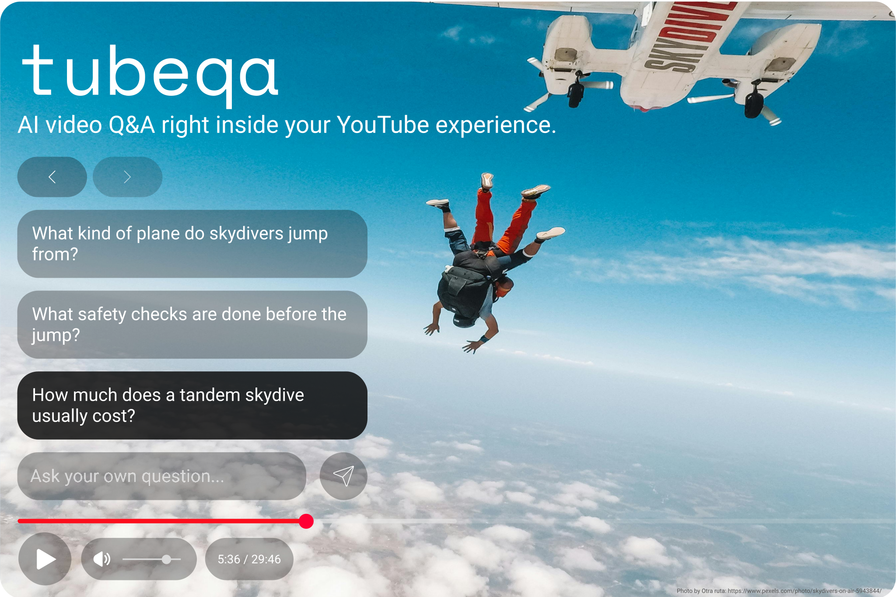
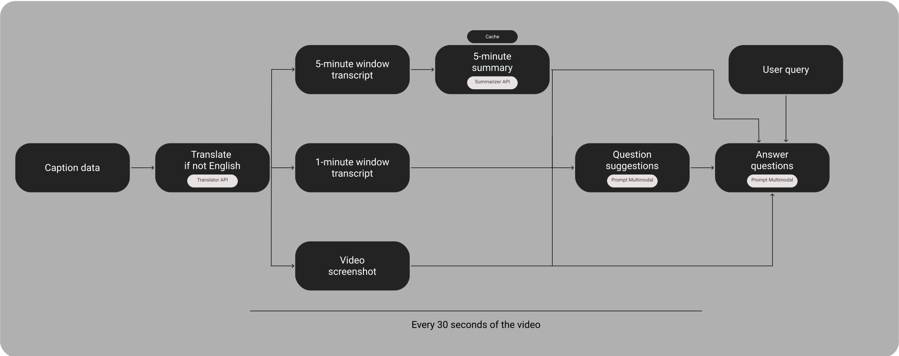

# tubeqa - AI video Q&A right inside your YouTube experience.

Built for [Google Chrome Built-in AI Challenge 2025](https://googlechromeai2025.devpost.com/)

## Testing Instructions
1. Enable chrome://flags/#optimization-guide-on-device-model and chrome://flags/#prompt-api-for-gemini-nano-multimodal-input
2. Go to chrome://extensions/
3. Enable Developer Mode
4. Click on the "Load unpacked" button
5. Select the "tubeqa" folder
6. The extension should now be loaded
7. (Optional) If you receive an error related to Origin Trial, you can add the Origin Trial token to the manifest.json file.
8. Go to any YouTube video
9. The extension should now be loaded and you should see the AI button in the player controls
10. It will automatically download the models in your first interaction. The process may take a few minutes. (In some cases, the model download process may not start due to a requirement related to user interaction. In this case, you can refresh the page.)
11. Enable AI Questions by clicking on the "AI Sparks" button in the player controls.
12. The questions are generated every 30 seconds while the video is playing.
13. Click on any suggested question, or type your own, and get instant, streaming answers that reflect the video’s context and visuals in real time.

## Chrome Version
The extension is tested on Chrome 142.0.7444.60 and Chrome Dev 143.0.7489.0. In [official documentation](https://developer.chrome.com/docs/ai/get-started), it is recommended to use the Chrome version 138 or higher for built-in AI features.

## Inspiration
One of the trends for the LLM world in 2025 is to enhance the experience. Generative UI concepts and integrations into applications such as browsers are redefining the AI interactions on user interfaces and freeing the generative power of LLMs from the limitations of cold walls of chatbot interfaces.

tubeqa preserves the video experience by adding the power of built-in LLMs to the YouTube video player, answering your questions about the video without pausing it or exiting full screen.

## What it does
tubeqa is a Chrome extension that brings intelligent, on-device AI assistance to your YouTube experience, helping you explore videos more interactively, without ever leaving the player.

**Automatic Question Generation**
Every 30 seconds, tubeqa reviews the current part of the video, using a one-minute transcript, a five-minute summary, and the current frame to come up with three thoughtful questions you might naturally ask while watching.

**Multimodal Understanding**
It combines both the video’s transcript and visuals to create questions and answers that truly match what’s happening on screen using Prompt API Multimodal.

**Real-time Answers**
Click on any suggested question, or type your own, and get instant, streaming answers that reflect the video’s context and visuals in real time.

**Seamless Language Support**
If the video does not have an English caption option, tubeqa translates the subtitles using the Translator API so the AI can understand and respond consistently.

**Conversational Flow**
tubeqa remembers your previous questions to keep the conversation connected.

**Fully Private, On-Device AI**
All processing happens locally, through Chrome’s built-in AI model APIs, ensuring complete privacy and zero external API calls.

## How I built it
tubeqa generates question suggestions and answers using YouTube's caption data and the **Prompt Multimodal API**, **Summarizer API**, and **Translator API** built into Chrome. In addition, it captures a screenshot of the video through the browser to utilize its multimodal features. It extracts this information every 30 seconds while the video is playing to generate questions, thus continuously feeding it with up-to-date video content.

### Note about caption data extraction
The extension does not misuse any YouTube API endpoint, copy or recreate any signature/key. It mimics user actions on YouTube's own player to trigger requests for English captions, using caption data obtained through natural and official ways. It performs this process very quickly and restores user settings to their previous state, ensuring no disruption to the user experience.

### Architecture
The extension consists of several key components:

1. **Content Script**: Main orchestrator that coordinates all components and manages video playback synchronization
2. **AI Clients**:
   - **Prompt Client**: Handles question generation and answering using the Prompt API
   - **Summarizer Client**: Creates video context summaries using the Summarizer API
   - **Translator Client**: Translates subtitles to English using the Translator API
3. **Utility Components**:
   - **Video Frame Extractor**: Captures video frames using Canvas API
   - **Subtitle Parser**: Extracts and processes YouTube caption tracks.
4. **UI Overlay**: Floating interface that displays questions and handles user interactions

### Data flow & processing pipeline

## Challenges I ran into
- **Adapting to the YouTube Player** – Capturing transcripts and embedding custom components directly into the YouTube player was challenging. During development, YouTube rolled out a major UI redesign, which required reworking and re-styling every element to fit the new interface.  
- **Time-Window-Based Content Management** – Managing content dynamically based on the video’s playback position, including transcript segments, summaries, screenshots, and question suggestions, required precise synchronization.  
- **Scalable Architecture Design** – Designing the system to remain flexible and scalable was a key challenge. Multiple AI APIs run in parallel across different workflows, so maintaining a modular structure that supports new integrations was critical for long-term growth.  

## Accomplishments that I'm proud of
### **Technical Achievements**
- **Seamless Integration** – Integrated AI assistance directly into the YouTube viewing experience without disrupting playback.  
- **Multimodal AI** – Implemented true multimodal processing by combining text transcripts with visual context for deeper understanding.  
- **Privacy-First Design** – Built a completely on-device solution with zero external API dependencies, ensuring total user privacy.  

### **User Experience**
- **YouTube-Native Design** – Developed an overlay that feels native to YouTube’s interface and enhances the viewing experience without distraction.  
- **Context Awareness** – Generated questions dynamically based on real video content and exact playback timing.  
- **Streaming Responses** – Delivered instant, streaming AI answers for real-time interaction and feedback.  
- **Cross-Layout Accessibility** – Optimized for different YouTube layouts, devices, and viewing modes.  
- **Multi-Language Support** – Automatic subtitle translation enables seamless access to global content.  

## What I learned
- Built my first Chrome extension from scratch, exploring how browser-based AI integrations work in practice.  
- Created my first multimodal AI project, combining visual and textual context to produce more relevant insights.  
- Internalized the importance of thoughtful UI design, ensuring that every element feels native to its environment and truly enhances the overall user experience.  

## What's next for tubeqa - AI video Q&A right inside your YouTube experience.
- **Multi-Language Queries** – Support user questions in different languages. The Language Detector API will identify the query’s language, determine the output language, and translate the final answer accordingly.  
- **Cross-Platform Integration** – Expand beyond YouTube by integrating the same experience into other video players.  
